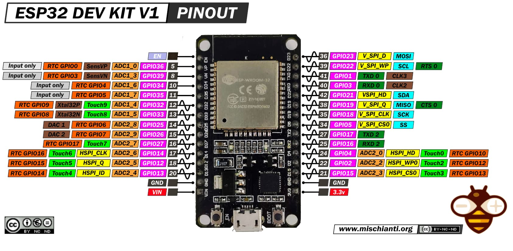
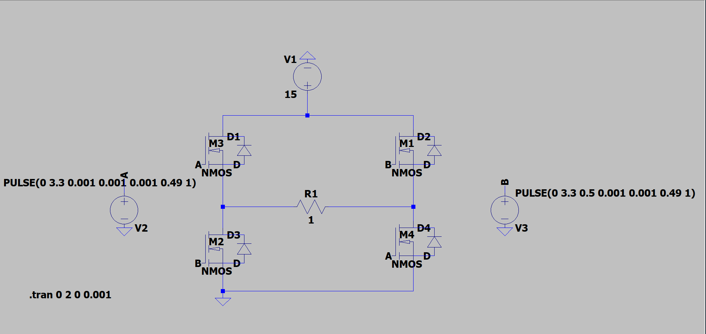

# RC car project
This is a small project to build and implement a remote controlled car using an ESP32 microcontroller.
The idea is to control the car using a web interface.
Also build a H bridge to control the motors.

## ESP32 PinOut

### ESP32 Used Pins
- Motor 1 (front) - forward: 25, backward: 26
- Motor 2 (back) - forward: 14, backward: 13

## H Bridge

